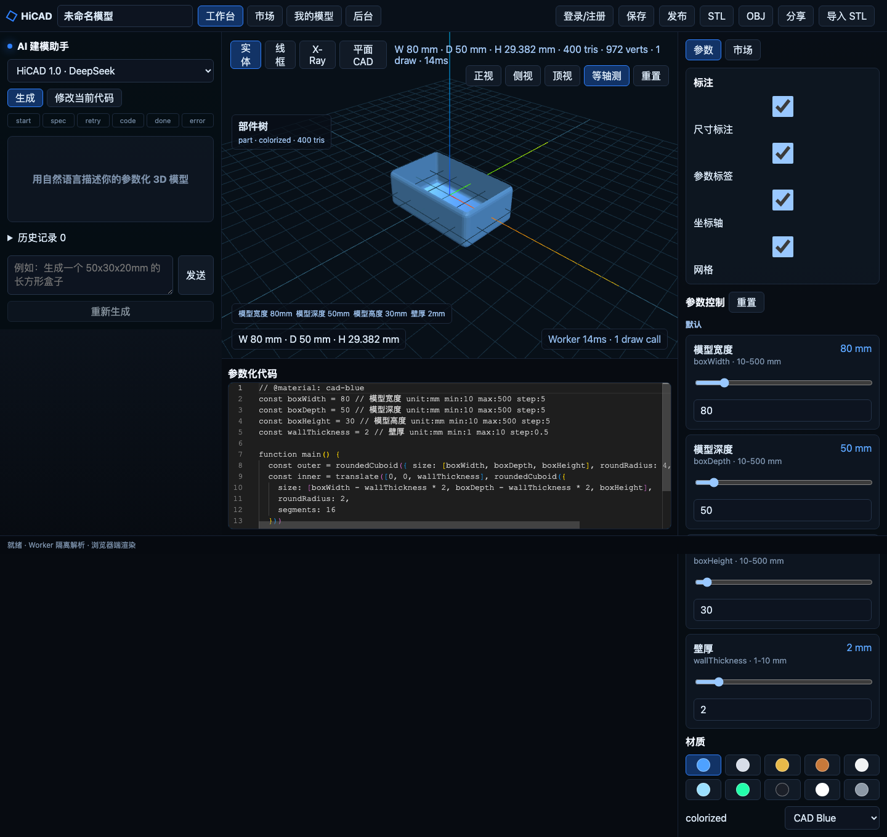

<div align="center">

# HiCAD-R

AI-assisted parametric CAD workspace for generating, editing, previewing, saving,
publishing, sharing, importing, and exporting JSCAD-based 3D models.



[](LICENSE)
[](https://nodejs.org/)
[](https://vuejs.org/)
[](https://nestjs.com/)
[](https://www.typescriptlang.org/)

[Repository](https://github.com/Pickbert/HiCAD-R) · [Issues](https://github.com/Pickbert/HiCAD-R/issues) · [Original Project](https://github.com/MrXujiang/HiCAD)

</div>

## What This Repo Is

HiCAD-R is a local-first, full-stack TypeScript CAD product prototype. It combines:

- a Vue 3 workspace for AI-assisted model generation, code editing, model library, marketplace, sharing, and admin views;
- a Three.js + JSCAD rendering pipeline that executes `main()` in a Web Worker and exports real STL/OBJ mesh data;
- a NestJS API for auth, model persistence, publishing, sharing, templates, AI streaming, feedback, payments, and admin operations;
- a quality gate covering backend HTTP integration tests, frontend component tests, CAD/Worker tests, Playwright E2E, audit, and bundle-size budgets.

The app is runnable as a single local service with `./start.sh`. The backend stores data in JSON files by default, which is convenient for local development and small deployments. Larger production use should move the repository layer to a database such as PostgreSQL.

## Attribution

HiCAD-R is based on the original open-source project [MrXujiang/HiCAD](https://github.com/MrXujiang/HiCAD). Thanks to the original author and contributors for the foundation and for releasing the project under GPL.

This repository is maintained at [Pickbert/HiCAD-R](https://github.com/Pickbert/HiCAD-R).

## Feature Status

| Area | Current status |
| --- | --- |
| Auth | Register/login modal, JWT access token, refresh token persistence, `/users/me`, first user becomes admin |
| Workspace | AI panel, Monaco editor, parameter panel, model metadata, save/publish/share actions with loading/error/toast states |
| AI | SSE generation flow with `start/spec/retry/code/done/error`, local fallback codegen, modify-current-code mode, diff/apply UX, history/regenerate |
| CAD runtime | JSCAD `main()` execution in Worker, safety checks, timeout handling, structured errors, transferable mesh data |
| Rendering | Three.js viewer, camera controls, preset views, solid/wireframe/X-Ray/plan modes, grid/axis/annotation toggles, stats and bounding box display |
| Materials | 10 material presets, model-level material, material comments, colored part grouping |
| Models | Mine/draft/published/shared filters, marketplace search/category/tag/sort, read-only share preview |
| Assets | ASCII STL import as Base64-backed model asset, real STL/OBJ export from mesh data, export preview with volume/triangles/unit |
| Admin | Users, models, templates, orders, feedback, activation code views and basic admin actions |
| Mobile/UI | Collapsible panels on narrow screens, shared toast/confirm/loading/empty/error components, keyboard and aria improvements |
| Quality | Vitest suites, Nest HTTP integration tests, Playwright E2E/screenshots, `pnpm ci:quality`, GitHub Actions workflow |

## Quick Start

### Requirements

- Node.js 18 or newer
- pnpm 9 or newer
- `lsof` for the startup script port preflight

```bash
pnpm install
cp .env.example .env
```

Edit `.env` before production use. For local development, the example values are enough to start the app, and `DEV_ACTIVATION_CODE=local-dev-code` can be used during registration.

### Production-style local run

```bash
./start.sh
```

Default URLs:

| Service | URL |
| --- | --- |
| App | http://127.0.0.1:3000 |
| API health | http://127.0.0.1:3000/api/health |

`start.sh` checks the selected port before installing/building/starting. If the port is occupied, it exits with the owning PID and suggests an alternate command. It only kills a listener when `HICAD_KILL_PORT=1` is set explicitly.

Useful variants:

```bash
PORT=3100 ./start.sh
MODE=dev ./start.sh
MODE=dev FRONTEND_PORT=5174 ./start.sh
HICAD_SKIP_PORT_CHECK=1 ./start.sh
```

### Development scripts

```bash
pnpm dev          # shared + backend + frontend dev servers
pnpm test         # shared, backend, frontend Vitest suites
pnpm typecheck    # TypeScript and Vue type checks
pnpm build        # shared -> backend -> frontend production build
pnpm bundle:check # frontend gzip budget check
pnpm test:e2e     # Playwright E2E against production build + start.sh
pnpm ci:quality   # audit + tests + typecheck + build + bundle + E2E
```

Playwright needs a browser installed once:

```bash
pnpm exec playwright install chromium
```

On Linux CI, use:

```bash
pnpm exec playwright install --with-deps chromium
```

## Configuration

Copy `.env.example` to `.env`. The most important settings are:

| Variable | Purpose |
| --- | --- |
| `PORT`, `HOST` | Backend/app bind address for production-style local service |
| `NODE_ENV` | Use `production` for deployed runtime checks |
| `DATA_DIR` | JSON database directory, defaulting to repository `data/` for local runs |
| `FRONTEND_DIR` | Built frontend directory served by the backend |
| `JWT_ACCESS_SECRET`, `JWT_REFRESH_SECRET` | Required random secrets in production, at least 32 characters |
| `PAY_CALLBACK_SECRET` | Required random payment callback signing secret in production |
| `DEV_ACTIVATION_CODE` | Local registration activation code |
| `AI_ADAPTER` | `deepseek`, `openai`, or `qwen` |
| `DEEPSEEK_API_KEY`, `OPENAI_API_KEY`, `QWEN_API_KEY` | Optional provider keys; missing keys trigger deterministic fallback |
| `CAD_WORKER_TIMEOUT_MS` | Worker render timeout |
| `CAD_MAX_CODE_BYTES` | Maximum CAD code size |
| `UPLOAD_MAX_STL_BYTES` | STL import payload limit |

The backend refuses unsafe production defaults for JWT/payment secrets. Keep `.env` private.

## AI Pipeline

The backend exposes OpenAI-compatible AI adapters for DeepSeek, OpenAI, and Qwen. The intended flow is:

1. receive a natural-language prompt;
2. stream SSE status events to the frontend;
3. ask the configured provider for a design spec when credentials are available;
4. fall back to deterministic local codegen when the provider is unavailable;
5. validate generated CAD code before the frontend applies it.

The frontend does not blindly replace code. Generated or modified code is staged as pending AI output, shown with a summary/diff-oriented apply step, and only then applied to the workspace.

## CAD Runtime And Rendering

The frontend Worker evaluates a constrained JSCAD runtime and supports common modeling operations such as:

- `cuboid`
- `roundedCuboid`
- `cylinder`
- `sphere`
- `union`
- `subtract`
- `translate`
- `rotate`
- `colorize`

Dangerous capabilities such as network access, browser storage, dynamic import, `Function`, and similar escape paths are blocked. The main thread enforces render timeouts and can pause auto-rendering for large models.

The viewer merges meshes by material to reduce draw calls, displays bounding boxes and mesh stats, and supports solid, wireframe, X-Ray, and plan CAD modes. STL and OBJ export use the current mesh data rather than placeholder geometry.

## Project Layout

```text
HiCAD/
├── backend/                 # NestJS API and JSON repository
│   ├── src/
│   │   ├── admin/           # Admin resources and diagnostics
│   │   ├── ai/              # AI adapters, SSE pipeline, codegen, safety checks
│   │   ├── auth/            # Registration, login, refresh tokens
│   │   ├── common/          # Guards, decorators, request context, error filter
│   │   ├── database/        # JSON persistence and migration
│   │   ├── models/          # CRUD, publish, share, revisions, STL import, exports
│   │   ├── pay/             # Mock payment provider and callback verification
│   │   └── templates/       # Template listing and use payloads
│   └── test/                # Unit and HTTP integration tests
├── frontend/                # Vue 3 application
│   ├── src/components/      # Workspace panels, viewer, modals, common UI states
│   ├── src/stores/          # Pinia workspace/auth/AI state
│   ├── src/utils/           # API, auth, parameters, mesh, runtime, export preview
│   └── src/workers/         # CAD Worker and testable Worker helpers
├── shared/                  # Shared types and CAD parameter utilities
├── e2e/                     # Playwright workflows and helpers
├── docs/                    # Development notes, TODOs, payment-provider notes
└── scripts/                 # Bundle budget check
```

## Quality Gate

The main project quality command is:

```bash
pnpm ci:quality
```

It runs:

1. `pnpm audit:prod` against the official npm registry with `--audit-level high`;
2. shared/backend/frontend tests;
3. TypeScript and Vue type checks;
4. production build;
5. frontend gzip bundle budget check;
6. Playwright E2E with `start.sh`.

Bundle budgets are enforced by `scripts/check-frontend-bundle.mjs`:

| Bundle | Gzip budget |
| --- | ---: |
| entry `index-*.js` | <= 500 KiB |
| async `monaco-editor-*` chunk | <= 1.2 MiB |
| total JS | <= 2.0 MiB |

The GitHub Actions workflow in `.github/workflows/ci.yml` runs the same quality gate.

## Deployment Notes

For a small server deployment:

```bash
pnpm install --frozen-lockfile
pnpm build
NODE_ENV=production \
PORT=3000 \
HOST=127.0.0.1 \
DATA_DIR=/var/lib/hicad \
FRONTEND_DIR=../frontend/dist \
pnpm --filter @hicad/backend start
```

Put Nginx/Caddy in front of the backend and proxy both `/` and `/api` to the same Node service. SSE endpoints need proxy buffering disabled.

The current payment provider is a signed mock provider. Do not treat it as a real payment integration. See `docs/PAYMENT_PROVIDERS.md` before integrating WeChat Pay, Alipay, Stripe, or another provider.

## Security Notes

- Production JWT/payment secrets must be random and at least 32 characters.
- CAD code is checked on both frontend/runtime surfaces and backend model-save paths.
- Worker rendering has timeout and structured error reporting.
- Admin routes require a server-side admin role.
- Payment callback signatures and amounts are verified.
- JSON persistence is intended for local/small deployment use; migrate the repository layer before high-concurrency production use.

## Roadmap

The P1 frontend, CAD/rendering, and testing/quality milestones are implemented in this repository. Remaining larger follow-ups include:

- Docker and compose deployment;
- PostgreSQL or another durable multi-user database backend;
- stronger real STL mesh preview/import handling beyond Base64 persistence;
- deeper CAD operation coverage and richer geometry inspection;
- real payment-provider integrations;
- collaborative editing.

See `docs/HICAD_TODO.md` for the detailed backlog.

## Contributing

Use focused branches and keep the quality gate green:

```bash
pnpm ci:quality
```

Issues and pull requests should target [Pickbert/HiCAD-R](https://github.com/Pickbert/HiCAD-R).

## License

This project is released under the [GNU General Public License v3.0](LICENSE).

Because this is a GPL project, derivative works must follow the GPL terms.
