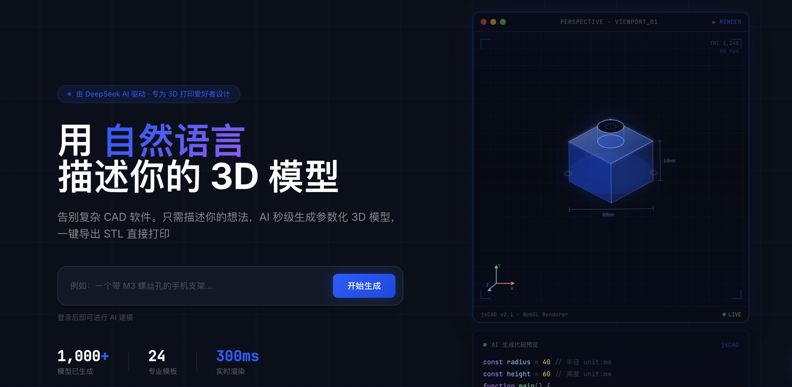

<div align="center">

# ⬡ HiCAD

**AI 驱动的参数化 3D CAD 建模平台**




*用自然语言描述你的想法，秒级生成可 3D 打印的参数化模型*

[](https://www.gnu.org/licenses/gpl-3.0)
[](https://nodejs.org/)
[](https://vuejs.org/)
[](https://nestjs.com/)
[](https://www.typescriptlang.org/)
[](https://github.com/Pickbert/HiCAD-R/pulls)

[🚀 demo](https://hicad.mvtable.com) · [✨ 功能特性](#-功能特性) · [🤖 AI 配置](#-ai-适配器配置) · [🛠️ 技术栈](#️-技术栈) · [🤝 参与贡献](#-参与贡献)

</div>

💡：在线体验：https://hicad.mvtable.com

---

## 🙏 致谢与来源

HiCAD-R 基于原始开源项目 [MrXujiang/HiCAD](https://github.com/MrXujiang/HiCAD) 继续整理、增强与产品化。感谢原作者和社区贡献者提供的基础工作与开源精神。

当前维护仓库：[Pickbert/HiCAD-R](https://github.com/Pickbert/HiCAD-R)

---

## ✨ 功能特性

| 功能 | 描述 |
|------|------|
| 🤖 **AI 智能建模** | 自然语言输入，AI 自动生成参数化 JSCAD 3D 代码 |
| 🎯 **双阶段精准建模** | 机械臂/坦克等复杂模型：意图分析 → 确定性代码生成，零定位误差 |
| 👁️ **实时 3D 预览** | WebWorker 驱动零卡顿渲染，Three.js 360° 旋转交互 |
| ✏️ **Monaco 代码编辑器** | VS Code 同款编辑器，语法高亮 + 智能补全 |
| 🎛️ **参数化控制面板** | 滑块实时调节模型尺寸参数，所见即所得 |
| 📦 **STL / OBJ 导出** | 一键导出，直接导入切片软件开始 3D 打印 |
| 🏪 **模板市场** | 浏览、使用、发布社区共享的 3D 参数化模板 |
| 🔗 **模型分享** | 生成分享链接，他人无需登录即可预览你的模型 |
| 🔄 **多 AI 适配器** | 支持 DeepSeek · OpenAI · Qwen，`.env` 一行切换 |
| 📱 **响应式设计** | 完美适配桌面端与移动端 |

---

## 🚀 快速开始

### 前置要求

- **Node.js** >= 18.0.0  
- **pnpm** >= 9.0.0

```bash
# 安装 pnpm（未安装时执行）
npm install -g pnpm
```

### 一键启动本地源码工程

```bash
# 1. 安装依赖
pnpm install

# 2. 准备环境变量
cp .env.example .env
# 编辑 .env：至少设置 JWT/PAY 密钥；需要真实 AI 时填写对应 API Key

# 3. 构建并启动生产式本地服务
./start.sh
```

🎉 启动成功后打开浏览器访问：

| 服务 | 地址 |
|------|------|
| 🌐 前端页面 | http://localhost:3000 |
| 🔌 后端 API | http://localhost:3000/api |

本地开发默认可使用 `.env` 中的 `DEV_ACTIVATION_CODE` 注册；生产环境请通过管理员接口创建一次性或限次激活码。

### 开发模式

```bash
MODE=dev ./start.sh
```

开发模式会同时启动 shared、backend、frontend，前端默认在 `http://127.0.0.1:5173`，后端默认在 `http://127.0.0.1:3000`。

---

## ⚙️ 环境变量说明

复制 `.env.example` 为 `.env` 并按需填写：

```env
PORT=3000
HOST=127.0.0.1
NODE_ENV=production

# 生产环境必须使用不少于 32 位的随机密钥；默认占位值会拒绝启动
JWT_ACCESS_SECRET=change-me-to-a-random-string-min-32-chars
JWT_REFRESH_SECRET=change-me-to-another-random-string-min-32-chars
PAY_CALLBACK_SECRET=change-me-payment-callback-secret-min-32-chars

# AI 适配器选择：deepseek | openai | qwen
AI_ADAPTER=deepseek
AI_TIMEOUT_MS=60000
AI_MAX_RETRIES=3

DEEPSEEK_BASE_URL=https://api.deepseek.com
DEEPSEEK_MODEL=deepseek-v4-pro
DEEPSEEK_API_KEY=

OPENAI_BASE_URL=https://api.openai.com/v1
OPENAI_MODEL=gpt-4o
OPENAI_API_KEY=

QWEN_BASE_URL=https://dashscope.aliyuncs.com/compatible-mode/v1
QWEN_MODEL=qwen-plus
QWEN_API_KEY=

DATA_DIR=../data
FRONTEND_DIR=../frontend/dist
CORS_ORIGIN=http://localhost:3000
CAD_WORKER_TIMEOUT_MS=5000
CAD_MAX_CODE_BYTES=200000
VITE_CAD_WORKER_TIMEOUT_MS=5000
VITE_CAD_MAX_CODE_BYTES=200000
UPLOAD_MAX_STL_BYTES=10485760
DEV_ACTIVATION_CODE=local-dev-code
```

---

## 🤖 AI 适配器配置

| 适配器 | 默认模型 | Endpoint | 获取 Key |
|--------|----------|----------|----------|
| `deepseek` ⭐ | `deepseek-v4-pro` | `https://api.deepseek.com` | [platform.deepseek.com](https://platform.deepseek.com/) |
| `openai` | `gpt-4o` | `https://api.openai.com/v1` | [platform.openai.com](https://platform.openai.com/) |
| `qwen` | `qwen-plus` | `https://dashscope.aliyuncs.com/compatible-mode/v1` | [dashscope.aliyuncs.com](https://dashscope.aliyuncs.com/) |

修改 `.env` 中的 `AI_ADAPTER` 字段即可切换，重启服务后生效。

后端统一使用 OpenAI-compatible `/chat/completions` 适配层。DeepSeek 对 `429 / 503 / 408 / 5xx` 自动重试，退避间隔为 `2s / 4s / 8s`；OpenAI 与 Qwen 复用同一 `AiAdapter` 接口。第三方 AI 不可用时，SSE 会明确发送 `error` 与 `fallback` 事件，再进入本地确定性 codegen，不会把 fallback 伪装成真实模型结果。

生成链路为两阶段：AI 只负责输出 `DesignSpec JSON`，后端 `jscad-codegen` 负责生成可审计的 JSCAD 参数化代码。Prompt 已按 `generic`、`arm`、`tank`、`room`、`vehicle` 拆分。

---

## 🛠️ 技术栈

<details>
<summary><b>前端技术</b></summary>

| 技术 | 版本 | 用途 |
|------|------|------|
| [Vue 3](https://vuejs.org/) | 3.x | UI 框架，Composition API |
| [Vite](https://vitejs.dev/) | 5.x | 构建工具，极速热重载 |
| [Pinia](https://pinia.vuejs.org/) | 2.x | 状态管理 |
| [Three.js](https://threejs.org/) | 0.160+ | WebGL 3D 渲染 |
| [Monaco Editor](https://microsoft.github.io/monaco-editor/) | 0.45+ | 代码编辑器（VS Code 内核） |
| [@jscad/modeling](https://openjscad.xyz/) | 2.x | 浏览器端参数化 CAD 几何执行 |
| JSCAD STL/OBJ serializer | 2.x | 真实网格导出 |

</details>

<details>
<summary><b>后端技术</b></summary>

| 技术 | 版本 | 用途 |
|------|------|------|
| [NestJS](https://nestjs.com/) | 10.x | Node.js 企业级框架 |
| [TypeScript](https://www.typescriptlang.org/) | 5.x | 类型安全 |
| [Passport JWT](http://www.passportjs.org/) | - | 无状态身份认证 |
| JSON Repository | - | 轻量级本地 JSON 数据层，预留迁移 PostgreSQL |
| Node `scrypt` | - | 密码安全哈希，无 native addon 构建风险 |
| SSE (Server-Sent Events) | - | AI 流式输出实时推送 |

</details>

---

## 📁 项目结构

```
hicad/
├── backend/                    # NestJS 后端服务
│   ├── src/
│   │   ├── ai/                 # AI adapters、prompt、fallback codegen、安全校验
│   │   ├── auth/               # JWT 认证、激活码注册
│   │   ├── common/             # requestId、统一错误、JWT/Admin guard
│   │   ├── database/           # JSON 数据库、migration、写入队列锁
│   │   ├── models/             # 模型、版本、发布、分享、市场、STL 导入
│   │   ├── pay/                # 支付 provider 抽象、mock provider、回调验签
│   │   ├── admin/              # 审计、封禁、模板精选、诊断
│   │   ├── templates/          # 模板接口
│   │   ├── users/              # 当前用户接口
│   │   ├── feedback/           # 反馈与状态
│   │   └── health/             # /api/health
│   └── test/                   # Vitest 单元、集成与安全测试
│
├── frontend/                   # Vue 3 前端
│   ├── src/
│   │   ├── components/         # 组件：AI 聊天框 / 3D 预览 / 代码编辑器
│   │   ├── stores/             # Pinia：用户 / 编辑器 / AI 状态
│   │   ├── workers/            # JSCAD WebWorker
│   │   └── utils/              # Mesh、STL/OBJ 导出、API 封装
│   └── public/                 # 静态资源
│
└── shared/                     # 前后端共享 TypeScript 类型
    └── src/                    # User / Model / AI / Template / 参数解析
```

---

## 🏗️ 构建与部署

### 本地开发

```bash
pnpm dev        # 同时启动前端(5173) + 后端(3000)，支持热重载
pnpm test       # shared + backend + frontend 测试
pnpm typecheck  # TypeScript / Vue 类型检查
pnpm build      # 构建生产版本（shared → backend → frontend）
pnpm start      # 生产模式启动后端，服务 frontend/dist
bash -n start.sh
```

`./start.sh` 是推荐入口：默认不抢占端口；若端口被占用会退出并提示。只有显式设置 `HICAD_KILL_PORT=1` 时，才会停止当前端口上的进程。

### 使用 PM2 部署到服务器

```bash
# 构建
pnpm build

# 使用随机生产密钥和真实域名 CORS
NODE_ENV=production PORT=3000 HOST=127.0.0.1 pnpm start
```

建议由 systemd、PM2 或容器平台守护 `pnpm --filter @hicad/backend start`，并把 `DATA_DIR` 指向可持久化目录。生产环境缺少随机 JWT / 支付回调密钥，或仍使用占位密钥时，后端会拒绝启动。

### Nginx 反向代理配置参考

```nginx
server {
    listen 80;
    server_name your-domain.com;

    # 前端静态文件
    location / {
        root /path/to/hicad/frontend;
        try_files $uri $uri/ /index.html;
    }

    # API 反向代理
    location /api {
        proxy_pass http://localhost:3000;
        proxy_set_header Host $host;
        proxy_set_header X-Real-IP $remote_addr;
        # 支持 SSE 流式响应
        proxy_buffering off;
        proxy_cache off;
        proxy_read_timeout 300s;
    }
}
```

---

## 🗺️ 路线图

- [x] AI 自然语言 → JSCAD 3D 模型
- [x] 双阶段精准建模（机械臂 / 坦克）
- [x] Monaco 代码编辑器 + 实时预览
- [x] 参数化控制面板
- [x] 模板市场
- [x] STL / OBJ 导出
- [x] 激活码注册系统
- [x] 真实 AI adapter + fallback SSE
- [x] JSCAD Worker 真几何渲染
- [x] 模型版本历史、发布快照、分享 token
- [ ] Docker 一键部署支持
- [ ] 更多 AI 模型类型（人形机器人、建筑结构）
- [ ] 协同编辑

---

## 🔐 安全说明

- 生产环境必须显式配置 `JWT_ACCESS_SECRET`、`JWT_REFRESH_SECRET`、`PAY_CALLBACK_SECRET`，默认值和占位值会被启动级检查拒绝。
- CAD 代码在浏览器 Worker 中执行，主线程设置超时并在超时后 terminate/recreate Worker；后端和前端都会拦截 `fetch`、`WebSocket`、`localStorage`、`indexedDB`、动态 import、`Function` 等危险能力。
- AI 输出先过 `DesignSpec JSON` 校验和确定性 codegen，再进行 CAD 代码边界校验，避免模型直接注入副作用代码。
- 支付当前实现为安全 mock provider，回调必须验签、校验金额、校验订单号并保持幂等。真实微信/支付宝/Stripe 接入前请参考 `docs/PAYMENT_PROVIDERS.md` 补齐平台签名与重放保护。
- 管理权限基于服务端角色，普通用户访问 `/api/admin/*` 会被拒绝。
- JSON 数据层适合 v1 轻量部署；高并发或多人团队生产环境建议迁移到 PostgreSQL，当前 Repository/Service 边界已为迁移预留。

---

## 📬 联系与支持

- 本地开发可使用 `.env` 中的 `DEV_ACTIVATION_CODE` 注册；生产环境请通过管理员接口创建激活码。
- 提交 [GitHub Issue](https://github.com/Pickbert/HiCAD-R/issues) 反馈 Bug 或功能建议。

---

## 📄 开源协议

本项目基于 [GNU General Public License v3.0](LICENSE) 开源。

```
Copyright (C) 2025 HiCAD Contributors

This program is free software: you can redistribute it and/or modify
it under the terms of the GNU General Public License as published by
the Free Software Foundation, either version 3 of the License, or
(at your option) any later version.
```

**本协议要求**：基于本项目的衍生作品必须同样以 GPL v3 协议开源。

---

<div align="center">

如果这个项目对你有帮助，请点一个 ⭐ **Star** 支持一下！

**HiCAD Contributors**

</div>
